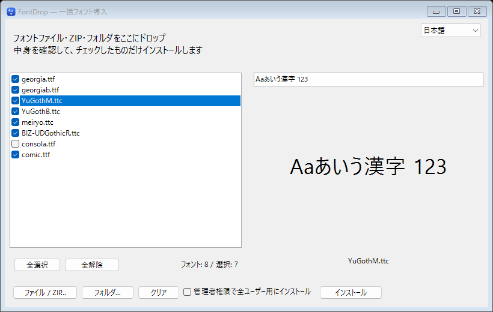

<p align="center">
  
</p>

<h1 align="center">FontDrop</h1>

<p align="center">
  Batch font installer for Windows.<br>
  Drop in fonts, ZIPs or whole folders, check what they look like, and install only the ones you want.
</p>

<p align="center">
  <a href="README_JP.md">日本語</a> ·
  <a href="#install">Install</a> ·
  <a href="#build">Build</a> ·
  <a href="https://capitata.dev">capitata.dev</a>
</p>

<p align="center">
  
</p>

## How it works

1. Drop font files, ZIP archives or folders onto the window, or pick them
   with **Files / ZIP...** and **Folder...**. Folders are searched with
   their subfolders.
2. Click a font to preview it. The sample text at the top of the preview
   can be changed.
3. Uncheck anything you do not want, then press **Install**.

Fonts are installed for the current user, so no administrator rights are
needed. To install for everyone on the PC, check **Install for all users
(administrator)** first; Windows asks for permission before anything is
copied. Fonts that are already installed are skipped.

Supported formats: `.ttf`, `.otf`, `.ttc`, `.fon` and `.fnt`.

The window is in Japanese or English, following Windows; you can switch it
from the menu in the top right.

## Install

Download `FontDrop-1.0.0.exe` from [Releases](https://github.com/Canta360/FontDrop/releases/latest)
and run it. There is nothing to install: it is a single program that runs on
Windows 10 and 11, which already include the .NET Framework it needs.

The program is not code-signed yet, so Windows SmartScreen may ask you to
confirm before it runs.

## Build

No SDK or packages are needed; the build uses the C# compiler that comes
with the .NET Framework on Windows.

```powershell
powershell -ExecutionPolicy Bypass -File .\build.ps1
```

This writes `bin\FontDrop.exe` and runs its self-test
(`FontDrop.exe --self-test`). `tools\make-icon.ps1` redraws the icon.

Pushing a `v*` tag builds the program on GitHub Actions and publishes a
release with its SHA-256 checksum, using the notes in
`.github/release-notes/<tag>.md`.

## Repository layout

| Path | Contents |
| --- | --- |
| `MainForm.cs` | The window: the font list, preview and install buttons. |
| `FontDiscovery.cs` | Finds fonts in files, folders and ZIP archives. |
| `FontInstaller.cs` | Copies fonts into place and registers them with Windows. |
| `Localization.cs` | Japanese and English text. |
| `Program.cs` | Start-up, the administrator install and the self-test. |
| `assets` | The icon. |

## License

FontDrop is available under the [MIT License](LICENSE).

FontDrop is made by [Capitata](https://capitata.dev).

<p align="center">
  <a href="https://capitata.dev">
    <picture>
      <source media="(prefers-color-scheme: dark)" srcset="docs/images/capitata-dark.png">
      
    </picture>
  </a>
</p>
