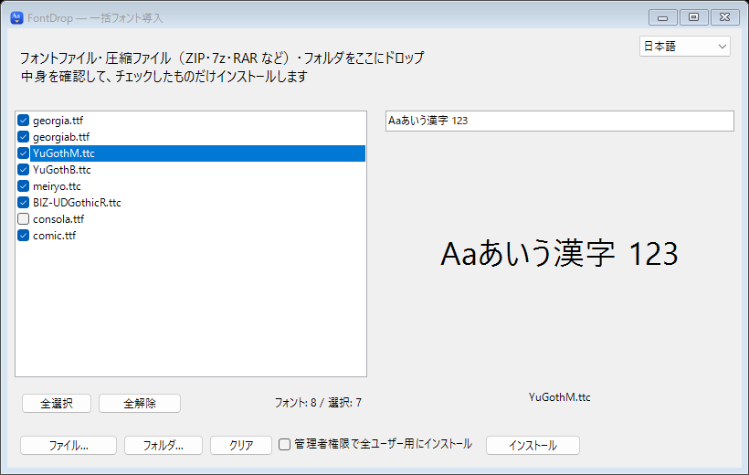

<p align="center">
  
</p>

<h1 align="center">FontDrop</h1>

<p align="center">
  Windows 用の、フォントをまとめてインストールするツール。<br>
  フォントや圧縮ファイル、フォルダをまるごとドロップして、見た目を確かめてから、必要なものだけをインストールできます。
</p>

<p align="center">
  <a href="README.md">English</a> ·
  <a href="#インストール">インストール</a> ·
  <a href="#ビルド">ビルド</a> ·
  <a href="https://capitata.dev">capitata.dev</a>
</p>

<p align="center">
  
</p>

## 使い方

1. フォントファイル、圧縮ファイル、フォルダをウィンドウにドロップします。
   「ファイル...」「フォルダ...」から選ぶこともできます。フォルダはサブフォルダまで探します。
2. フォントをクリックするとプレビューが表示されます。上の欄でサンプルの文字を変えられます。
3. いらないもののチェックを外して、「インストール」を押します。

インストール先は現在のユーザーなので、管理者権限はいりません。PC のすべてのユーザーに入れたいときは、
先に「管理者権限で全ユーザー用にインストール」にチェックを入れてください。コピーの前に Windows が確認を求めます。
すでにインストールされているフォントはスキップします。

対応フォント: `.ttf`、`.otf`、`.ttc`、`.fon`、`.fnt`（単体、または次の圧縮ファイルの中）

| 圧縮形式 | 拡張子 |
| --- | --- |
| ZIP | `.zip` |
| 7-Zip | `.7z` |
| RAR | `.rar` |
| tar | `.tar`、`.tar.gz`、`.tgz`、`.tar.bz2`、`.tbz2`、`.tbz`、`.tar.xz`、`.txz`、`.tar.zst`、`.tzst` |
| LZH | `.lzh`、`.lha` |
| キャビネット | `.cab` |

ZIP の中の 7z のように、圧縮ファイルの中の圧縮ファイルも 3 階層まで開きます。
パスワード付きや壊れたものは飛ばし、ほかのフォントを追加したあとで、どれを開けなかったかをお知らせします。

画面は Windows の表示言語に合わせて日本語か英語で表示され、右上のメニューで切り替えられます。

## プライバシー

FontDrop の処理はすべて PC の中で行われます。ネットワークは使わず、アカウントやテレメトリもなく、設定や履歴も保存しません。
圧縮ファイルから取り出したフォントは一時フォルダに置き、FontDrop を閉じると消します。
詳しくは[プライバシーについて](PRIVACY.md)をご覧ください。

## インストール

[Releases](https://github.com/Canta360/FontDrop/releases/latest) から `FontDrop-1.0.2.exe` をダウンロードして実行してください。
インストールは不要で、ひとつのファイルだけで動きます。

**動作環境:** Windows 11。ZIP 以外の圧縮ファイルは Windows 11 に付いている `tar` で開き、.NET Framework も
Windows に最初から入っているものを使うので、ほかに必要なものはありません。

まだコード署名をしていないため、初回の起動時に Windows SmartScreen が確認を求めることがあります。

## ビルド

SDK やパッケージは不要で、Windows の .NET Framework に付いている C# コンパイラでビルドします。

```powershell
powershell -ExecutionPolicy Bypass -File .\build.ps1
```

`bin\FontDrop.exe` ができ、続けてセルフテスト（`FontDrop.exe --self-test`）が実行されます。
アイコンは `tools\make-icon.ps1` で、リポジトリを共有したときに GitHub が表示する画像は
`tools\make-social-preview.ps1` で描き直せます（アイコンと英語のスクリーンショットから作ります）。

`v*` のタグを push すると、GitHub Actions がビルドし、`.github/release-notes/<タグ>.md` のノートと
SHA-256 チェックサムを付けてリリースを公開します。

## ライセンス

FontDrop は [MIT License](LICENSE) で公開しています。

FontDrop は [Capitata](https://capitata.dev) が作っています。

<p align="center">
  <a href="https://capitata.dev">
    <picture>
      <source media="(prefers-color-scheme: dark)" srcset="docs/images/capitata-dark.png">
      
    </picture>
  </a>
</p>
